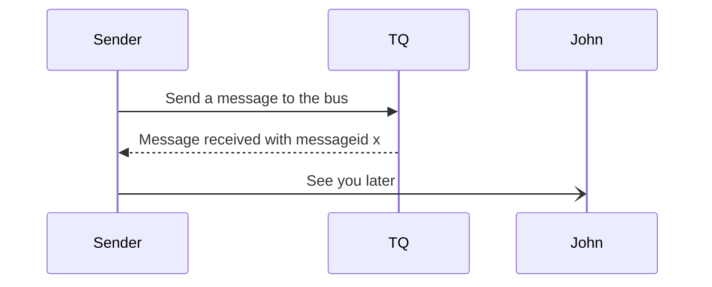
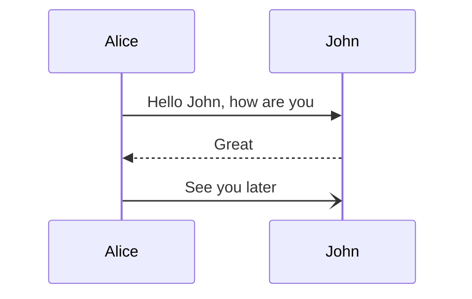

# TableQueue

TableQueue (TQ for short) is a simple table based queue module. It's ment to be used where full blown messagingsystems are simply overkill.
It is based on general idea with Event Sourcing having one table with all events saved to it Event Store.

In TQ we have one table called EVENTSTORE and one called EVENTSTORESS (daily snapshot).
For each app processing messages we create seperate tables.
In the sample we have:

* EVENTSTORE_SNAPSHOT, used for service populating snapshot EVENTSTORESS
* EVENTSTORE_TEMPLATE, used as a template for creating EVENTSTORE_<app queue table>
* EVENTSTORE_GUARDIAN, our internal table used for our guardian features

## Sequence flows

### Actors

* Sender, app sending a message
* Receiver, app(s) receiving a message
* TQ, Table Queue internal routine. Can be stored procedure, trigger or additional external application running

### Adding message to bus

 
### Fetching message from bus

 
## Tables with triggers

* TABLEQUEUE main table that receives messages
* ** MSGDESTINATION is the destination of the data. A value of * gets handled by router stored procedure
* TABLEQUEUEROUTING contains routing for all MSGORIGIN = * then get replicated to respective additional specific MSGORIGIN.
* TABLEQUEUEHISTORY is a history table containing X days old messages
* TABLEQUEUECONFIG is a table containing configuration
  
## Stored Procedures

* spTableQueueRouting
